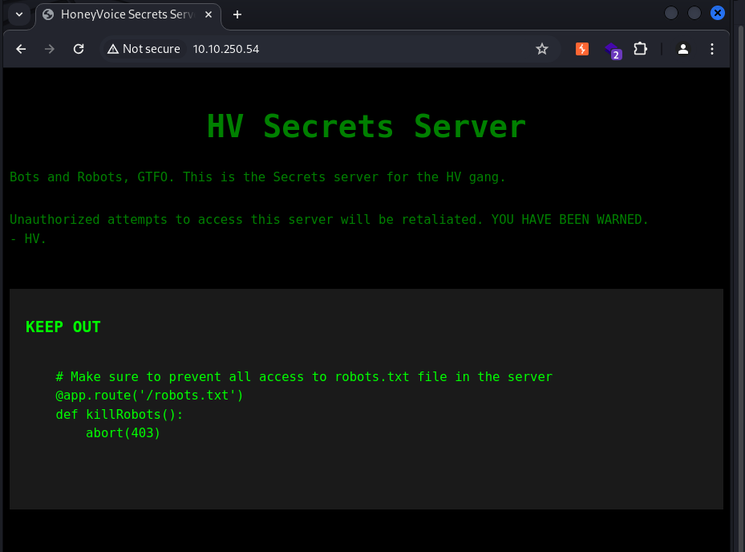

# 레드라쿤 모의해킹 기초 실습방 (모의해킹 기초)
| 강의 영상 없이 진행

이전 RemoteWebAdm에서 서버가 너무 느리고 연결이 자꾸 끊기는 현상이 있었다. 이번에는 정보수집부터 조심스럽게 접근해서 모의해킹을 진행한다.

# 정보수집
nmap을 이용하여 재시도 횟수나, min-rate를 정하여 진행하니 빠르게 진행됬다.
```
┌──(kali㉿kali)-[~/tryhackme/Robots]
└─$ nmap --top-ports 1000 --max-retries 1 --min-rate 1500 --open 10.10.250.54 -oA tcpAll
Starting Nmap 7.94SVN ( https://nmap.org ) at 2024-05-14 19:01 KST
Nmap scan report for 10.10.250.54
Host is up (0.28s latency).
Not shown: 662 closed tcp ports (conn-refused), 336 filtered tcp ports (no-response)
Some closed ports may be reported as filtered due to --defeat-rst-ratelimit
PORT   STATE SERVICE
22/tcp open  ssh
80/tcp open  http

Nmap done: 1 IP address (1 host up) scanned in 1.94 seconds

┌──(kali㉿kali)-[~/tryhackme/Robots]
└─$ nmap -p 22,80 --max-retries 1 --min-rate 1500 -Pn -n --open -sV -sC 10.10.250.54 -oA tcpDetailed
Starting Nmap 7.94SVN ( https://nmap.org ) at 2024-05-14 19:02 KST
Nmap scan report for 10.10.250.54
Host is up (0.28s latency).

PORT   STATE SERVICE VERSION
22/tcp open  ssh     OpenSSH 7.6p1 Ubuntu 4ubuntu0.7 (Ubuntu Linux; protocol 2.0)
| ssh-hostkey: 
|   2048 c8:27:95:ed:47:88:cb:69:fa:2e:19:c7:03:5f:b3:26 (RSA)
|   256 96:8e:85:5b:f6:bc:43:76:52:24:dd:72:4c:65:27:79 (ECDSA)
|_  256 22:87:05:24:cb:7a:3f:b2:a4:5e:e2:88:9a:69:b2:af (ED25519)
80/tcp open  http    Apache httpd 2.4.29 ((Ubuntu))
|_http-title: HoneyVoice Secrets Server
| http-robots.txt: 1 disallowed entry 
|_/admin.html
|_http-server-header: Apache/2.4.29 (Ubuntu)
Service Info: OS: Linux; CPE: cpe:/o:linux:linux_kernel

Service detection performed. Please report any incorrect results at https://nmap.org/submit/ .
Nmap done: 1 IP address (1 host up) scanned in 17.02 seconds
```
22번 포트에서는 openssh 7.6p1 그리고 웹서버 80번 포트에서는 apache 2.4.29 버전을 사용한다. 
웹서버 타이틀 -> HoneyVoice Secrets entry
robots.txt 존재 확인 등등 네트워크 서비스 배너그래빙으로 웹 서버에 대한 추가적인 정보를 획득했다.

### Web(80)

첫 웹사이트의 랜딩페이지이다. 뭔가 코드를 보여주고있는데 robots.txt 경로를 보여주고있다. 
페이지 소스에서는 별다른 정보를 얻지 못했다.


`/robots.txt` 경로로 접속을 해보니 `index.php`만 Allow 가 되어잇고, /admin.html은 Disallow가 되어있다. 
`/admin.html`로 접속을 해본다!!


가짜 관리자의 페이지 인것 같다. 진짜 관리자의 페이지는 `XXXX.hv.html` 파일에 있다고 한다. XXXX는 모두 숫자라고 힌트를 주고있다. 

```
# 박스의 어떤 포트들이 열려있나요?  (예. 445,3389,139,135) 
22,80

# 웹서버의 검색엔진 최적화 (SEO)에 쓰이도록 만들어졌지만, 잘못 설정될 경우 원치않은 디렉토리나 페이지를 유출할 수 있는 파일 이름은 뭔가요? 
robots.txt
```
# 취약점 진단
힌트를 보아 웹 서버가 가지고 있는 파일들을 봐야하는데 4자리의 숫자로 이루어져 있다고한다. 배시쉘 스크립트를 이용해 4자리 숫자로 된 리스트 파일을 하나 만들어 gobuster 툴을 이용해 디렉터리 브루트포싱을 하여 관리자 페이지를 획득한다.
```
┌──(kali㉿kali)-[~/tryhackme/Robots]
└─$ vim loop4.bash

#!/bin/bash

for i in {1111..9999}; do
        echo ${i}.hv.html >> admin_page.txt;
done


┌──(kali㉿kali)-[~/tryhackme/Robots]
└─$ chmod +x loop4.bash; ./loop4.bash

┌──(kali㉿kali)-[~/tryhackme/Robots]
└─$ cat admin_page.txt | head -10
1111.hv.html
1112.hv.html
1113.hv.html
1114.hv.html
1115.hv.html
1116.hv.html
1117.hv.html
1118.hv.html
1119.hv.html
1120.hv.html

┌──(kali㉿kali)-[~/tryhackme/Robots]
└─$ gobuster dir -u http://10.10.250.54/ -w admin_page.txt -t 10 | tee gobuser-admin
===============================================================
Gobuster v3.6
by OJ Reeves (@TheColonial) & Christian Mehlmauer (@firefart)
===============================================================
[+] Url:                     http://10.10.250.54/
[+] Method:                  GET
[+] Threads:                 10
[+] Wordlist:                admin_page.txt
[+] Negative Status codes:   404
[+] User Agent:              gobuster/3.6
[+] Timeout:                 10s
===============================================================
Starting gobuster in directory enumeration mode
===============================================================
/7289.hv.html         (Status: 200) [Size: 653]
Progress: 8889 / 8890 (99.99%)
===============================================================
Finished
===============================================================

```
`/7289.hv.html` 파일의 경로를 획득했다. 웹서버에 경로를 추가해 들어간다.

웹 페이지에서는 딱히 얻을 정보가 없지만 소스에서 주석으로 지워지지 않은 secret 유저의 계정 정보가 남아있는 것을 확인했다.
```
# 첫번째 플래그를 찾은 페이지는 뭐였나요? (예. /1337.hv.html) 
7289.hv.html

# secret 유저의 비밀번호는 뭔가요? 
HV-NOPERS-1337!!

# 첫번째 플래그는 뭔가요? 
GROOT{숨김숨김}
```

# 초기 침투
secret 유저의 계정정보를 파악했다. SSH 포트가 열려있는 것을 정보수집 때 파악했으니 SSH 접속을 통해서 초기 침투를 한다.
```
┌──(kali㉿kali)-[~/tryhackme/Robots]
└─$ ssh secret@10.10.250.54 
secret@10.10.250.54's password: <HV-NOPERS-1337!!>
Welcome to Ubuntu 18.04.6 LTS (GNU/Linux 4.15.0-206-generic x86_64)

 * Documentation:  https://help.ubuntu.com
 * Management:     https://landscape.canonical.com
 * Support:        https://ubuntu.com/advantage

 System information disabled due to load higher than 1.0


110 updates can be applied immediately.
86 of these updates are standard security updates.
To see these additional updates run: apt list --upgradable

Ubuntu comes with ABSOLUTELY NO WARRANTY, to the extent permitted by
applicable law.


Last login: Sat Mar 11 18:27:08 2023 from 192.168.40.132
$ whoami; id ;ip a
secret
uid=1000(secret) gid=1000(secret) groups=1000(secret)
1: lo: <LOOPBACK,UP,LOWER_UP> mtu 65536 qdisc noqueue state UNKNOWN group default qlen 1000
    link/loopback 00:00:00:00:00:00 brd 00:00:00:00:00:00
    inet 127.0.0.1/8 scope host lo
       valid_lft forever preferred_lft forever
    inet6 ::1/128 scope host 
       valid_lft forever preferred_lft forever
2: eth0: <BROADCAST,MULTICAST,UP,LOWER_UP> mtu 9001 qdisc fq_codel state UP group default qlen 1000
    link/ether 02:16:c7:1b:74:d1 brd ff:ff:ff:ff:ff:ff
    inet 10.10.250.54/16 brd 10.10.255.255 scope global dynamic eth0
       valid_lft 2967sec preferred_lft 2967sec
    inet6 fe80::16:c7ff:fe1b:74d1/64 scope link 
       valid_lft forever preferred_lft forever
$ 
$ bash
secret@honeyvoice-robots:~$

secret@honeyvoice-robots:~$ ls -al
total 40
drwxr-xr-x 4 secret secret 4096 Mar 11  2023 .
drwxr-xr-x 3 root   root   4096 Mar 11  2023 ..
lrwxrwxrwx 1 secret secret    9 Mar 11  2023 .bash_history -> /dev/null
-rw-r--r-- 1 secret secret  220 Apr  4  2018 .bash_logout
-rw-r--r-- 1 secret secret 3771 Apr  4  2018 .bashrc
drwx------ 2 secret secret 4096 Mar 11  2023 .cache
drwx------ 3 secret secret 4096 Mar 11  2023 .gnupg
-rw-r--r-- 1 secret secret  807 Apr  4  2018 .profile
-rwxrwxrwx 1 root   root     88 Mar 11  2023 .roothint.lmao
-rw------- 1 secret secret    1 Mar 11  2023 .viminfo
-rw------- 1 secret secret  118 Mar 11  2023 .Xauthority
secret@honeyvoice-robots:~$ cat .roothint.lmao 
how did you get in here? Bet you won't find the secret file though.  <  secrets.txt  > 
```
숨김 파일 되어있는 `.roothint.lmao` 파일을 열어보니 `secrets.txt` 파일에 대한 언급을 하고 있다.
```
secret@honeyvoice-robots:~$ find / -name "secrets.txt" 2> /dev/null
/etc/apache2/secrets.txt

secret@honeyvoice-robots:~$ cat /etc/apache2/secrets.txt 
GROOT{숨김숨김}
```

task를 풀기 위한 모든 정보를 얻었으니 여기서 끝!

# 취약점
1. 랜딩 페이지에 노출되어있는 robots.txt 파일의 경로 및 파일
2. `/7289.hv.html` 페이지 소스에 주석으로 되어있는 secret 유저의 계정 정보

